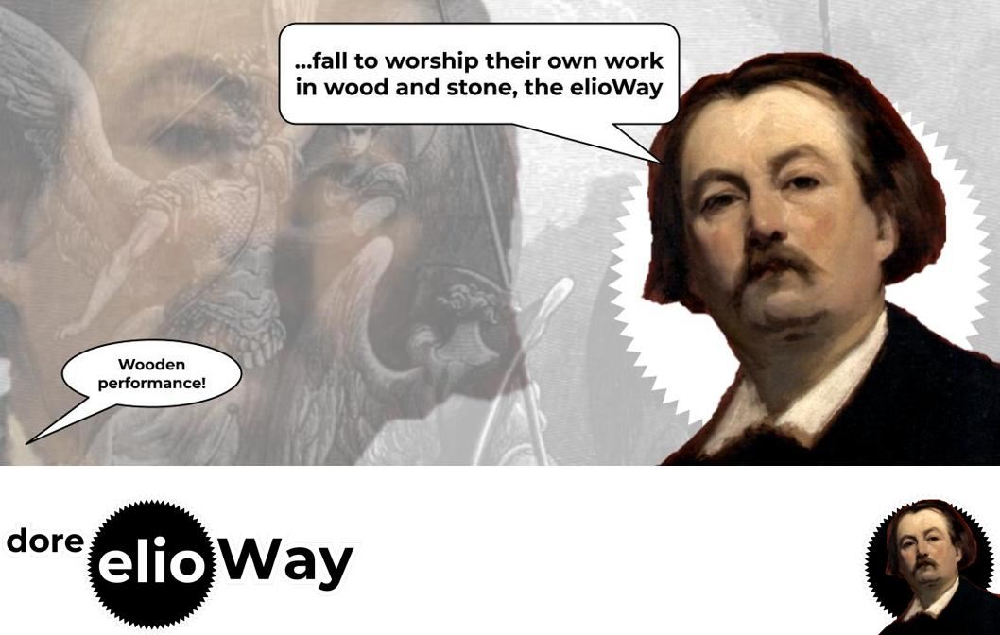

# dore

Implementation of an `ImageGallery`, with Gustave Doré art, the elioWay

- [dore Documentation](./doc/index.md)

## Seeing is Believing

```
cd ~/Dev/theelioway/dore
```

- [dore Quickstart](./quickstart.md)

## Prerequisites

- [dore Prerequisites](./prerequisites.md)

## Installing

- [Installing dore](./installing.md)

# Credits

- [dore Credits](./credits.md)

## License

[MIT](license)


